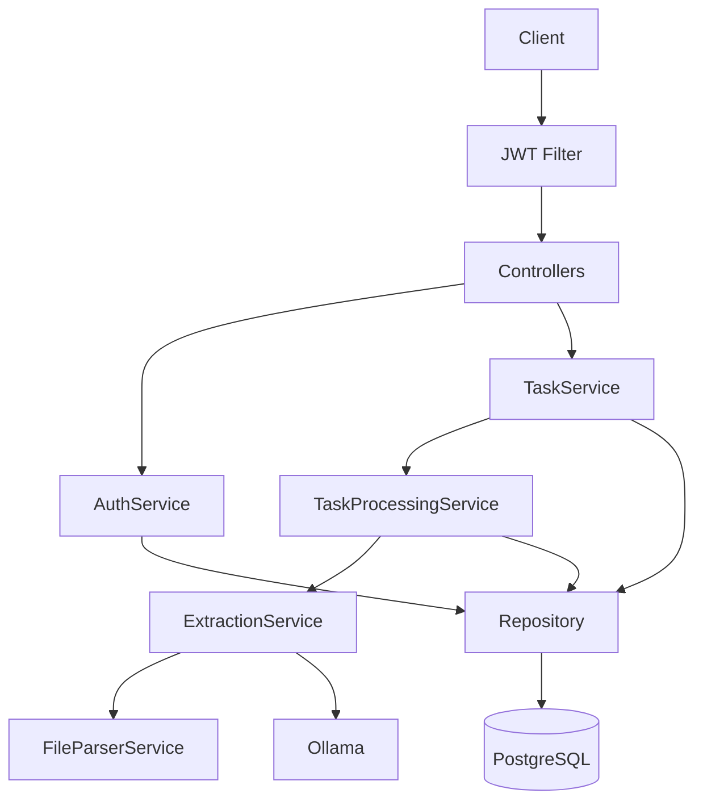

# CP Processor — AI агент подбора поставщиков по закупке

Сервис для обработки коммерческих предложений (КП) и связанных документов. Загружаешь файл — получаешь структурированные данные о товарах, артикулах, количестве, единицах измерения, ценах и поставщиках.
Для известных структурированных Excel-форматов используется детерминированный парсинг без LLM, для остальных документов — обработка через Ollama + Spring AI.


---

## Запуск

Нужен только Docker. GPU (NVIDIA) подхватывается автоматически.

```bash
docker compose up --build
```

Модель `gemma4:e2b` (~7.2 ГБ) скачивается автоматически при первом запуске.

Готово: http://localhost:8080
Swagger: http://localhost:8080/swagger-ui/index.html

```bash
docker compose down      # остановить
docker compose down -v   # остановить + удалить данные
```

---

## Стек

- **Java 17** + **Spring Boot 3.5.13** — основа
- **Spring Security + JWT (jjwt 0.12.7)** — stateless аутентификация, JWT выбрал потому что stateless, проще масштабировать
- **Spring Data JPA / Hibernate** — ORM
- **PostgreSQL 16** — основная БД, JSONB для гибкого хранения результатов
- **Spring AI 1.0.0 + Ollama (Gemma 4 E2B)** — локальный AI для извлечения данных из КП, без внешних API-ключей
- **Apache POI 5.3.0** — парсинг xlsx/xls/docx
- **Apache PDFBox 3.0.4** — парсинг pdf
- **Apache Commons Compress 1.27.1** — распаковка zip-архивов
- **Liquibase** — миграции БД
- **springdoc-openapi 2.8.16** — Swagger UI
- **Docker + Docker Compose** — запуск одной командой
- **JUnit 5 + Mockito** — тесты

---

## Архитектура



**Как это работает:**
- Клиент аутентифицируется через `/auth/login`, получает JWT
- Загружает файл через `POST /cp/tasks` — создаётся задача в статусе `PENDING`
- Обработка идёт асинхронно: `TaskProcessingService` (отдельный бин для корректной работы `@Async` через Spring AOP) передаёт содержимое в `ExtractionService`
- `ExtractionService` выбирает стратегию обработки:
  - для известных структурированных Excel-форматов используется детерминированный парсер без LLM
  - для неструктурированных и полуструктурированных документов `FileParserService` извлекает текст, после чего `ExtractionService` через Spring AI отправляет промпт в Ollama
- Для LLM-ветки `BeanOutputConverter` автоматически парсит ответ AI в Java record `ExtractionResult`
- Результат сохраняется в БД
- Клиент проверяет статус через `GET /cp/tasks/{id}`

---

## Структура проекта

```
src/main/java/com/cpprocessor/
├── config/        # Spring Security, Async, OpenAPI конфигурация
├── controller/    # REST endpoints (auth + tasks)
├── dto/           # Request/Response объекты, ExtractionResult (record для AI)
├── entity/        # JPA сущности Task, User + enums
├── exception/     # Глобальный обработчик ошибок
├── repository/    # Spring Data JPA репозитории
├── security/      # JWT сервис, фильтр, UserDetailsService
├── service/       # Бизнес-логика: AuthService, TaskService, TaskProcessingService, ExtractionService, FileParserService
└── util/          # FileUtils
```

---

## API

| Метод | URL | Описание | Авторизация |
|---|---|---|---|
| POST | `/auth/login` | Получить JWT | Нет |
| POST | `/auth/register` | Создать пользователя | ADMIN |
| POST | `/cp/tasks` | Загрузить файл КП | JWT |
| GET | `/cp/tasks/{task_id}` | Статус и результат | JWT |

### Примеры

```bash
# Логин
curl -X POST http://localhost:8080/auth/login \
  -H "Content-Type: application/json" \
  -d '{"username":"admin","password":"admin123"}'

# Загрузка файла
curl -X POST http://localhost:8080/cp/tasks \
  -H "Authorization: Bearer <TOKEN>" \
  -F "file=@commercial_proposal.xlsx"

# Проверка статуса
curl http://localhost:8080/cp/tasks/<TASK_ID> \
  -H "Authorization: Bearer <TOKEN>"
```

**Дефолтный аккаунт:** admin / admin123 (ROLE_ADMIN)

---

## Тесты

```bash
./mvnw test
```

20+ тестов: unit-тесты сервисов (TaskService, AuthService, JwtService, FileParserService) + интеграционные тесты контроллеров с MockMvc.

---

## Поддерживаемые форматы файлов

| Формат | Библиотека | Что извлекается |
|---|---|---|
| `.xlsx` / `.xls` | Apache POI | Все листы, строки и ячейки; для известных structured Excel-форматов возможен direct parsing без LLM |
| `.docx` | Apache POI (XWPF) | Параграфы + таблицы |
| `.pdf` | Apache PDFBox | Весь текстовый слой |
| `.csv` | — | Как есть (UTF-8) |
| `.zip` | Commons Compress | Рекурсивная распаковка, парсинг каждого файла внутри |
| `.rar` / `.7z` | — | Принимаются, но содержимое полноценно не извлекается / возвращается пустой результат |
| `.txt` | — | Поддерживается парсером, но зависит от серверной валидации расширений |

---

## Проверенные сценарии

Во время ручной проверки были успешно протестированы следующие кейсы:

- `cp_processing_tasks(backend).xlsx` — structured Excel, обрабатывается без LLM, статус `COMPLETED`
- `asd.docx` — DOCX, обрабатывается через LLM, статус `COMPLETED`
- `test_kp_office.xlsx` — Excel коммерческого предложения, обрабатывается через LLM, статус `COMPLETED`

---

## Почему Ollama, а не OpenAI / Anthropic

- **Бесплатно** — не нужны API-ключи, нет оплаты за токены
- **Приватность** — данные КП не уходят на внешние серверы
- **Автономность** — работает оффлайн после скачивания модели
- **Gemma 4 E2B** (~7.2 ГБ) — достаточно лёгкая локальная модель, подходит для извлечения данных из неструктурированных и полуструктурированных документов

Для продакшена с большими объёмами можно переключить на:
- `gemma4:e4b` (~9.6 ГБ) — лучше качество, больше памяти
- OpenAI / Anthropic API через Spring AI (заменить `spring-ai-starter-model-ollama` на `spring-ai-starter-model-openai`)

---

## Компромиссы

- **In-memory** — файлы не сохраняются на диск. В проде — S3/MinIO
- **@Async** — для масштабирования в проде лучше RabbitMQ/Kafka
- **Две роли** — USER/ADMIN. Для продакшена нужны более гранулярные права
- **Seed-пользователь** через Liquibase миграцию — удобно для демо
- **rar/7z** — не распаковываются (нет стабильных Java-библиотек с Apache-лицензией)

---

## Что можно улучшить

- Apache Tika для автоопределения формата файлов
- Refresh tokens + механизм отзыва токенов
- Rate limiting на API endpoints
- S3/MinIO для хранения загруженных файлов
- RabbitMQ/Kafka вместо @Async для надёжной обработки задач
- Пагинация списка задач (`GET /cp/tasks?page=0&size=20`)
- Spring Profiles для разделения dev/prod конфигурации
- Индексы в БД по статусу задач и username
